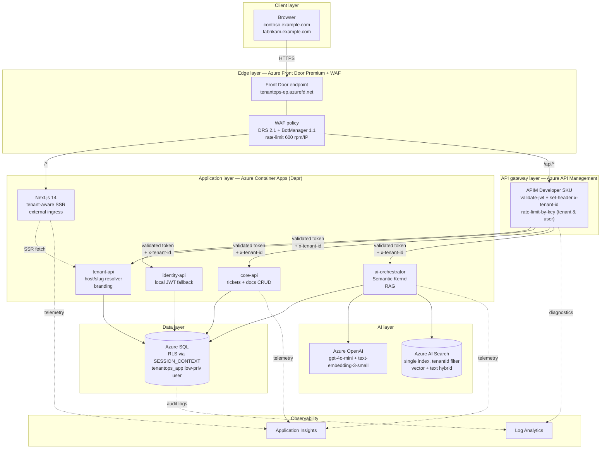
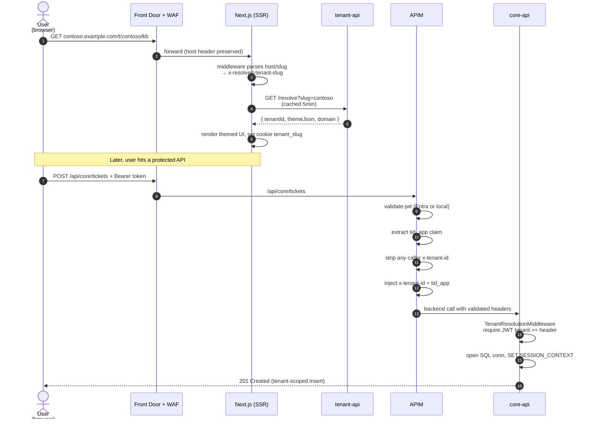
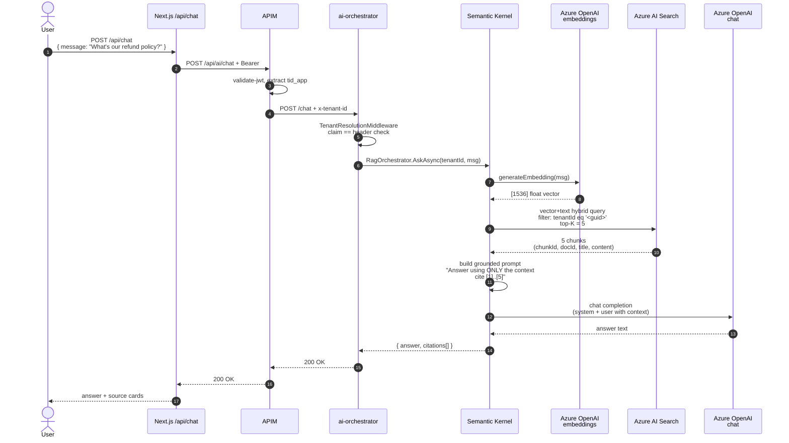

# TenantOps — Architecture

This document describes every layer of the TenantOps demo, the cross-cutting
tenant-isolation model, the RAG pipeline, and the control flow for a typical
request. It is intentionally dense with Microsoft Learn links so every
pattern can be cross-checked against the authoritative source.

---

## 1. Layer overview



### Layer responsibilities

**Client layer — Next.js 14 (App Router, SSR).** Tenant-aware SSR resolves
the tenant from the request host or the `/t/{slug}` route param, then renders
themed UI using CSS custom properties set on `<body>`. Server actions handle
form submissions with httpOnly-cookie JWTs so tokens never reach client JS.
Reference: https://nextjs.org/docs/app/building-your-application/routing

**Edge layer — Azure Front Door Premium + WAF.** Global anycast entry
point, TLS termination, static asset CDN, and WAF (DRS 2.1 managed rules,
Bot Manager 1.1, custom IP rate limit). Two origin groups: the Next.js
Container App for `/*`, APIM for `/api/*`.
Reference: https://learn.microsoft.com/azure/frontdoor/front-door-overview

**API gateway layer — Azure API Management (Developer SKU).** The only
component authorised to issue the `x-tenant-id` header that backend services
trust. `validate-jwt` verifies Entra ID and local issuer tokens; the
authoritative `tid_app` claim is extracted and injected as `x-tenant-id`.
Per-tenant and per-user `rate-limit-by-key` provide noisy-neighbour
protection.
Reference: https://learn.microsoft.com/azure/api-management/api-management-policies

**Application layer — Azure Container Apps with Dapr.** One environment
hosting five apps: `web` (external ingress), `identity-api`, `tenant-api`,
`core-api`, `ai-orchestrator` (all internal ingress only). Each app is
Dapr-enabled (`app_id` = service name, HTTP protocol) so cross-service calls
can use service invocation with mTLS + retries.
References:
- https://learn.microsoft.com/azure/container-apps/overview
- https://learn.microsoft.com/azure/container-apps/dapr-overview

**Service layer — .NET 8 minimal APIs.** Each service shares a
`TenantOps.Shared` library that provides the `TenantResolutionMiddleware`,
`TenantDbConnectionFactory`, dual JWT authentication setup (Entra + local),
and Serilog + correlation ID scaffolding.

**Data layer — Azure SQL Database with Row-Level Security.** Single
database, multi-tenant with RLS predicates on `Tickets`, `Documents`,
`Users`. The `tenantops_app` user is low-privileged (`SELECT/INSERT/UPDATE/
DELETE` on the `app` schema only) so even `sa`/`db_owner` cannot accidentally
bypass the predicate.
Reference: https://learn.microsoft.com/sql/relational-databases/security/row-level-security

**AI layer — Azure OpenAI + Azure AI Search.** Embeddings from
`text-embedding-3-small` (1536-dim), chat completion from `gpt-4o-mini`,
vector + text hybrid queries against a single shared AI Search index with a
mandatory `tenantId` filter.
References:
- https://learn.microsoft.com/azure/ai-services/openai/
- https://learn.microsoft.com/azure/search/vector-search-overview

**Observability layer — Log Analytics + Application Insights.** APIM
diagnostics, SQL audit events, and service telemetry all pipe into one
workspace. Every log line carries `TenantId`, `UserId`, and `CorrelationId`
properties via Serilog scopes.
Reference: https://learn.microsoft.com/azure/azure-monitor/

---

## 2. Multi-tenant isolation model

Tenant isolation is enforced at three independent layers. Compromise of any
one layer does not yield cross-tenant access.

### 2.1 Tenant resolution sequence



Resolution priority (per spec §2):

1. **Custom domain.** `Host` header matched against `app.Tenants.Domain`.
   This is the production path — each customer gets their own hostname via
   Front Door custom domains.
2. **Route param.** `/t/{slug}` used for local dev and as a fallback when
   custom domains aren't configured. Matches `app.Tenants.Slug`.
3. **Subdomain of `localtest.me`.** A dev convenience so `contoso.localtest
   .me` resolves to `127.0.0.1` without hosts-file edits, providing
   realistic host-based routing locally.

### 2.2 Trust boundary between APIM and backends

The `x-tenant-id` header is the only tenant identifier that reaches backend
services — but it is never trusted on its own. The `TenantResolutionMiddleware`
(`services/_shared/TenantOps.Shared/Tenancy/TenantResolutionMiddleware.cs`)
requires both of the following to agree:

1. The `tid_app` claim on the validated JWT.
2. The `x-tenant-id` header (stripped of any caller-supplied value at APIM,
   then re-written from the validated claim).

If either is missing, the middleware returns `403 Forbidden`. If they
disagree, the middleware logs a warning and returns `403`. This double-signal
design means:

- A Contoso user who forges `x-tenant-id: fabrikam` is rejected because the
  JWT claim still says contoso.
- A Contoso user who obtains a Fabrikam JWT is rejected at APIM because
  `validate-jwt` fails on audience or issuer mismatch (unless they control
  the token-signing key, at which point the security model has larger
  problems than tenant isolation).

### 2.3 Data-layer enforcement

Even with perfect application-layer validation, a missing `WHERE TenantId`
clause in one repository method could leak data. RLS makes this impossible.

Every `SqlConnection` opened by `TenantDbConnectionFactory.OpenAsync()`
executes this before returning:

```sql
EXEC sp_set_session_context @key=N'TenantId',        @value=<guid>, @read_only=1;
EXEC sp_set_session_context @key=N'IsPlatformAdmin', @value=0,      @read_only=1;
```

The `read_only=1` flag prevents the value from being overwritten on the same
connection — so even a compromised repository method cannot switch tenants
mid-request without first closing the connection.

The `sec.fn_tenant_predicate` function tests `TenantId =
CAST(SESSION_CONTEXT('TenantId') AS UNIQUEIDENTIFIER)` and the
`sec.TenantIsolationPolicy` applies it as both `FILTER` (hides rows on read)
and `BLOCK` (rejects writes that would cross tenants). The BLOCK predicate
covers `AFTER INSERT`, `AFTER UPDATE`, `BEFORE UPDATE`, and `BEFORE DELETE`
— the four transitions spec'd for `CREATE SECURITY POLICY`.

The `tenantops_app` login has only DML rights on `schema::app` — no
`db_owner` role — so `sp_set_session_context` cannot be replaced and the
predicate cannot be disabled through the app's credentials.

### 2.4 AI Search isolation

Per the chosen design (spec §1 + clarification Q2), isolation uses a **single
index with mandatory tenant filter** rather than index-per-tenant. The
isolation controls are:

1. **Schema.** The `tenantId` field is declared `filterable` and is set on
   every chunk at index time
   (`services/ai-orchestrator/Search/DocumentIndexer.cs`).
2. **Retriever invariant.** `SearchRetriever.SearchAsync()` builds the
   filter itself from the caller-supplied `tenantId` — callers cannot pass
   a filter in. `Guid.Empty` is rejected. A runtime invariant check asserts
   the filter literally contains `tenantId eq '<tenantId>'` before the query
   is issued.
3. **No bypass path.** The chat endpoint constructs `tenantId` exclusively
   from `TenantContext`, which was populated by the middleware's JWT-claim
   + header-agreement check.

Indexing inherits the same invariant: `DocumentIndexer.IndexAsync()` refuses
`Guid.Empty` and stamps `tenantId` on every chunk.

---

## 3. RAG pipeline



The orchestrator (`services/ai-orchestrator/Rag/RagOrchestrator.cs`) is
deliberately thin — it embeds, retrieves, prompts, completes, and returns.
Semantic Kernel earns its place by giving us a kernel-level DI surface for
future plugins (for example, a `TicketsPlugin` that would let the agent
create a ticket from within a chat session) without rewriting the pipeline.

### Prompt grounding

The system prompt is fixed at construction time and directs the model to
(a) answer only from the provided context and (b) cite sources as `[1]`,
`[2]`, etc. matching numbered context items. If the retrieved chunks are
empty, the user message becomes `Context: (no documents found for this
tenant)` and the model's system prompt directs it to say "I don't have
that information in the tenant's knowledge base."

### Chunking

The demo uses a simple character-based chunker (1000 chars, 150 char
overlap) which is adequate for the seed documents. Production deployments
should swap this for a tokenizer-aware chunker (e.g. `tiktoken` or the
Azure AI Document Intelligence `Document Layout` skill for long-form PDFs).
Reference: https://learn.microsoft.com/azure/search/search-how-to-integrated-vectorization

---

## 4. Identity & authentication

Two JWT bearer schemes are registered (`AuthSetup.cs`) behind a single
policy scheme named `TenantOps`:

- **Entra scheme (primary).** Validates tokens from
  `https://login.microsoftonline.com/<tenant>/v2.0` with audience
  `api://tenantops`. This is the production path.
- **Local scheme (fallback).** Validates HMAC-SHA256 tokens issued by
  `identity-api` for local dev and for demos without an Entra tenant.

The policy scheme uses `ForwardDefaultSelector` to peek at the bearer
token's issuer and route to the correct validator, so a single `.RequireAuthorization()`
call covers both paths without service-level branching.

In both cases the token must carry a `tid_app` claim containing the
application-level tenant GUID. Entra tokens get this claim via:

- An **optional claims** entry on the Entra app registration that maps
  `extension_<ext-id>_TenantId` into `tid_app`; or
- An **app role** assignment that carries the tenant id in the `roles`
  array and is mapped by a post-issuance hook.

The demo seed script doesn't provision Entra objects — that's deployment-
specific. `docs/SETUP.md` walks through the manual steps.

---

## 5. Observability

Every service emits structured logs with these dimensions via Serilog scopes:

- `Service` (application name)
- `CorrelationId` (mint-or-echo from `x-correlation-id`)
- `TenantId` (set inside `TenantResolutionMiddleware` for the duration of
  the request)
- `UserId` (when the JWT carries `oid` or `sub`)

These are all indexable in Log Analytics with KQL queries like:

```kql
AppTraces
| where Properties.TenantId == "11111111-1111-1111-1111-111111111111"
| where TimeGenerated > ago(1h)
| project TimeGenerated, Message, Properties.CorrelationId, Properties.UserId
```

APIM request telemetry flows to Application Insights via
`azurerm_api_management_logger`. SQL audit events flow to Log Analytics via
`azurerm_monitor_diagnostic_setting` on the database.

---

## 6. Repository layout

```
apps/web/                  Next.js 14 App Router
services/
  _shared/TenantOps.Shared Tenant middleware, SQL session ctx, auth, defaults
  identity-api/            Local JWT issuer (PBKDF2-SHA256)
  tenant-api/              Host/slug resolver + branding
  core-api/                Tickets + documents CRUD
  ai-orchestrator/         Semantic Kernel RAG pipeline
infra/
  sql/                     Migrations (schema + RLS) and seed
  apim/policies/           validate-jwt + tenant injection XML
  terraform/
    modules/               sql, ai, aca, apim, frontdoor, network
    environments/          per-env .tfvars
    backends/              per-env remote state config
.github/workflows/         CI (build+test), images (ACR push), infra (TF)
tests/integration/         RLS leakage tests + AI Search filter tests
docs/                      this file plus SETUP, DEMO, THREAT_MODEL,
                           ASSUMPTIONS
scripts/                   seed-documents.sh
```
