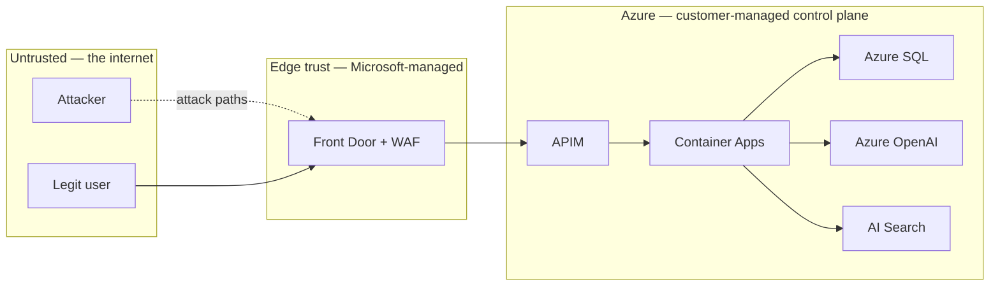

# TenantOps — Threat Model

STRIDE-structured analysis of TenantOps' trust boundaries, with emphasis
on tenant isolation. Each row lists the asset under threat, the attack
pattern, the primary mitigation, and the layer of defence in depth.

Scope: the deployed application as configured in `infra/terraform` with
the default `environments/dev.tfvars`. Out of scope: physical data-centre
security, Azure control-plane compromise, supply-chain attacks on NuGet
or npm packages (handled organisationally).

---

## Trust boundaries

The security-critical boundary this project is designed to defend is the
**one between authenticated tenants** — not the one between the internet
and Azure, which Azure handles well on its own. A user of tenant A, even
after successfully authenticating, must never be able to read, write, or
infer data belonging to tenant B.

---

## Isolation proof points

Before the STRIDE table: the three independent isolation controls that
together make cross-tenant access impossible. The demo can prove each
interactively (see `docs/DEMO.md` parts 3, 4, 6).

### IP-1 — APIM enforces validated tenant header

- **File:** `infra/apim/policies/api-authenticated.xml`
- **Mechanism:** `<set-header name="x-tenant-id" exists-action="delete"/>`
  runs *before* `<validate-jwt/>`; the header is then re-written from the
  cryptographically-validated `tid_app` claim. A caller-supplied header
  cannot pre-empt the authoritative value.
- **Corroboration:** `TenantResolutionMiddleware` rejects requests where
  the JWT claim and the header disagree (403).

### IP-2 — SQL RLS with read-only session context

- **File:** `infra/sql/migrations/002_rls.sql` and
  `services/_shared/TenantOps.Shared/Data/TenantDbConnectionFactory.cs`
- **Mechanism:** every connection sets `SESSION_CONTEXT('TenantId',
  @value, @read_only=1)`. `sec.fn_tenant_predicate` filters every row;
  `sec.TenantIsolationPolicy` blocks cross-tenant writes. The
  `tenantops_app` user has no role that permits bypassing RLS.
- **Corroboration:** `tests/integration/RlsIsolationTests.cs` — six
  automated assertions.

### IP-3 — AI Search filter invariant

- **File:** `services/ai-orchestrator/Search/SearchRetriever.cs`
- **Mechanism:** filter is built internally from a caller-supplied
  `tenantId`; `Guid.Empty` is rejected; a runtime invariant check verifies
  the filter string before the query is issued.
- **Corroboration:** `tests/integration/SearchTenantFilterTests.cs`.

---

## STRIDE analysis

### Spoofing (S)

| # | Asset | Attack | Mitigation | Defence layer |
|---|-------|--------|------------|---------------|
| S1 | User identity | Attacker forges a JWT for another tenant | `validate-jwt` verifies signature + issuer + audience. Local JWTs are HMAC-SHA256 with a 256-bit key stored in env/Key Vault. Entra tokens are RS256 with Microsoft-rotated keys. | APIM |
| S2 | Tenant identifier | Caller sets `x-tenant-id: <other-tenant>` | APIM strips the header then re-writes from `tid_app` claim (IP-1). Middleware requires claim/header agreement. | APIM + App |
| S3 | APIM bypass | Attacker discovers the ACA app FQDN and bypasses APIM entirely | Container Apps have `external_enabled = false` on all back-end services. Only the web frontend and APIM itself have public ingress. Outbound from web to services goes over the internal Container Apps DNS. | ACA |
| S4 | Platform admin role | Attacker claims `role: platform-admin` in a forged token | Role claim comes from the signed token; `validate-jwt` rejects unsigned modifications. Admin endpoints additionally require the `tenantops_app` SQL session to have `IsPlatformAdmin=1`, which is only set by the tenant-api's admin codepath. | APIM + SQL |

### Tampering (T)

| # | Asset | Attack | Mitigation | Defence layer |
|---|-------|--------|------------|---------------|
| T1 | Tenant session context | App code or SQL injection attempts to `sp_set_session_context` to another tenant mid-request | `read_only=1` causes subsequent sets on the same connection to fail (tested in RLS test 5). Pooled connections are reset between uses. | SQL |
| T2 | Row data | App bug writes `TenantId` = other tenant into a new row | `sec.TenantIsolationPolicy` has a `BLOCK AFTER INSERT` predicate — violating rows fail the insert. Tested in RLS test 4. | SQL |
| T3 | Search index | Indexer stamps wrong `tenantId` on chunks | `DocumentIndexer.IndexAsync()` takes the `tenantId` from the calling `TenantContext` (middleware-populated) and refuses `Guid.Empty`. Re-indexing deletes prior chunks by `documentId` first so a previously-mis-stamped chunk is replaced. | App |
| T4 | Front Door origin | Attacker tampers with `X-Forwarded-For` to confuse WAF rate limits | Front Door rewrites headers based on its own observations; the WAF custom rule uses `RemoteAddr` (Azure-sourced) not client headers. | AFD |

### Repudiation (R)

| # | Asset | Attack | Mitigation | Defence layer |
|---|-------|--------|------------|---------------|
| R1 | Audit trail | User denies performing an action | Every request carries `x-correlation-id` (minted or echoed by APIM); Serilog scopes emit `TenantId`, `UserId`, `CorrelationId` on every log line; APIM logger writes to App Insights; SQL auditing writes `SQLSecurityAuditEvents` to Log Analytics. | Observability |
| R2 | Admin actions | Platform admin modifies another tenant | Tenant catalogue writes use a separate connection with `IsPlatformAdmin=1` set — which is logged by the app and by SQL auditing. | SQL + App |

### Information Disclosure (I)

| # | Asset | Attack | Mitigation | Defence layer |
|---|-------|--------|------------|---------------|
| I1 | Other tenant's rows | Missing `WHERE TenantId` in a repository query | RLS `FILTER` predicate hides rows regardless of query text (IP-2, RLS test 3). | SQL |
| I2 | Other tenant's chunks | Retriever forgets to filter on `tenantId` | Retriever builds filter internally + invariant check (IP-3). | App |
| I3 | Embeddings themselves | Embeddings for tenant B are retrievable by tenant A | Vectors are stored alongside `tenantId`; the same filter applies to vector queries (AI Search applies filters to non-vector fields and the filter runs before vector scoring). | AI Search |
| I4 | JWT leakage | Browser JS reads access token from localStorage | Tokens are stored in `httpOnly; secure; sameSite=lax` cookies. All API calls go through Next.js server components or the `/api/chat` BFF proxy; the browser never sees the bearer token. | Web |
| I5 | Error messages | Stack traces leak tenant ids or PII | Production config disables developer exception page; Serilog formats scrub token/body; `server` and `x-powered-by` stripped by APIM. | APIM + App |
| I6 | DNS enumeration | Attacker enumerates Container Apps FQDNs to find internal services | Internal ACA apps have non-guessable FQDNs (prefixed with revision hash) and refuse external traffic. | ACA |

### Denial of Service (D)

| # | Asset | Attack | Mitigation | Defence layer |
|---|-------|--------|------------|---------------|
| D1 | Service availability | Volumetric attack on Front Door | Front Door has built-in Azure DDoS Protection Basic; WAF custom rate-limit rule (600 rpm/IP). | AFD |
| D2 | Noisy tenant | One tenant floods the API and starves others | APIM `rate-limit-by-key` keyed on `tid_app` (60 rpm/tenant) and on user oid (60 rpm/user). | APIM |
| D3 | Expensive AI calls | Attacker burns tenant's AOAI quota | Per-tenant rate limit applies to `/ai/chat`. AOAI capacity is set via deployment `capacity` (20 TPM for chat). Container Apps `max_replicas` caps concurrency. | APIM + AOAI |
| D4 | Storage exhaustion | Attacker uploads massive documents | Next.js `bodySizeLimit: '2mb'` at the server-action boundary; SQL `Content NVARCHAR(MAX)` is bounded by connection-level transaction size; Container Apps memory limits prevent runaway. | App + ACA |

### Elevation of Privilege (E)

| # | Asset | Attack | Mitigation | Defence layer |
|---|-------|--------|------------|---------------|
| E1 | SQL bypass | App exploits SQL injection to drop RLS | Parameterised queries (Dapper) throughout; `tenantops_app` user has DML on `schema::app` only — cannot `DROP SECURITY POLICY`, cannot `CREATE USER`, cannot `ALTER FUNCTION sec.fn_tenant_predicate`. | SQL |
| E2 | Cross-tenant admin | Regular user gains `platform-admin` role | Role claim is set at Entra app-role assignment time; not self-service. The role isn't sufficient alone — the platform-admin SQL connection is a separate code path that doesn't run for normal requests. | Entra + App |
| E3 | Supply chain | Malicious package in `npm install` | Lockfile committed (`package-lock.json`); Dependabot alerts enabled at repo level; container images scanned by ACR built-in Microsoft Defender for Containers (when enabled). | CI/Org |
| E4 | Container escape | Malicious code in one service escapes to host | Container Apps run non-root (`USER nextjs` for web; `dotnet` user for services). Hyper-V isolation provided by ACI underneath. | ACA |

---

## Residual risks

- **Demo-only components.** The `identity-api` fallback uses a dev secret
  in env; in production that path must be disabled or the key must come
  from Key Vault.
- **Single database.** RLS is strong but a single DB's blast radius for a
  vulnerability disclosure is still all tenants. Production deployments
  at scale should evaluate **Elastic Pool per tier** or **database per
  tenant** (spec §1 default can be swapped via the `sql` module).
- **APIM Developer SKU.** Single-instance, no SLA. Production must use
  Standard v2 or Premium with zone redundancy.
- **Prompt injection.** A malicious KB document could attempt to override
  the orchestrator's grounding instructions. Mitigations not implemented:
  input sanitisation on document upload, Azure AI Content Safety on
  outputs, structured output constraints. Recommended pre-production.

## References

- Microsoft's multi-tenant SaaS guidance: https://learn.microsoft.com/azure/architecture/guide/multitenant/overview
- OWASP ASVS v4 for checklist gap analysis: https://owasp.org/www-project-application-security-verification-standard/
- Azure SQL RLS best practices: https://learn.microsoft.com/sql/relational-databases/security/row-level-security
- Threat modelling Azure apps: https://learn.microsoft.com/azure/security/develop/threat-modeling-tool
